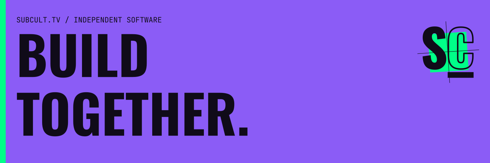

# SUBCULT

**Software for independent culture.**

SUBCULT builds software for clips, searchable archives, music visuals, link pages, community coordination and live events. Each project has its own audience, scope and stage of development.

[Website](https://subcult.tv) · [Products](https://subcult.tv/products) · [Development on Gitea](https://git.subcult.tv/subculture-collective) · [Contact](mailto:info@subcult.tv)

## Explore the work

| Project | What it does | Where to start |
|---|---|---|
| **clpr** | Discover Twitch clips by creator, topic and tag; keep and share playlists. | [Public app](https://clpr.tv) · [Source](https://git.subcult.tv/subculture-collective/clpr) |
| **HasanAra** | Search HasanAbi broadcast transcripts and return to timestamped source passages. | [Public archive](https://hasanara.tv) · [Source](https://git.subcult.tv/subculture-collective/hasanara) |
| **Rekolekt** | Software for self-hosted, timestamped recording archives. HasanAra uses its shared core. | [Source and deployment](https://git.subcult.tv/subculture-collective/rekolekt) |
| **Undertow** | Make layered music visuals with artwork, lyrics and local browser video export. | [Public editor](https://undertow.subcult.tv) · [Source](https://git.subcult.tv/subculture-collective/undertow) |
| **Kork** | Build a link page for your work, channels and events. | [Public app](https://kork.subcult.tv) · [Source](https://git.subcult.tv/subculture-collective/kork) |
| **Patchwork** | A pre-alpha AT Protocol demonstration of local requests, offers and coordination. | [Demonstration](https://patchwork.subcult.tv) · [Source](https://git.subcult.tv/subculture-collective/patchwork) |
| **Subcult OS** | Event planning, staffing, free reservations, door check-in and reporting software in development. | [Source](https://git.subcult.tv/subculture-collective/subcult-os) |

Machine transcripts need checking against recordings. Patchwork is a demonstration rather than a place to request real aid. Undertow's local export depends on browser support; paid cloud plans are not available.

## Build with us

Development, issues, pull requests and CI live on [Gitea](https://git.subcult.tv/subculture-collective). GitHub publishes copies of the repositories. Start with a project's README and contribution guidance, and use its Gitea issue tracker for bugs or proposals.

For development, creative work or collaboration: [info@subcult.tv](mailto:info@subcult.tv).
